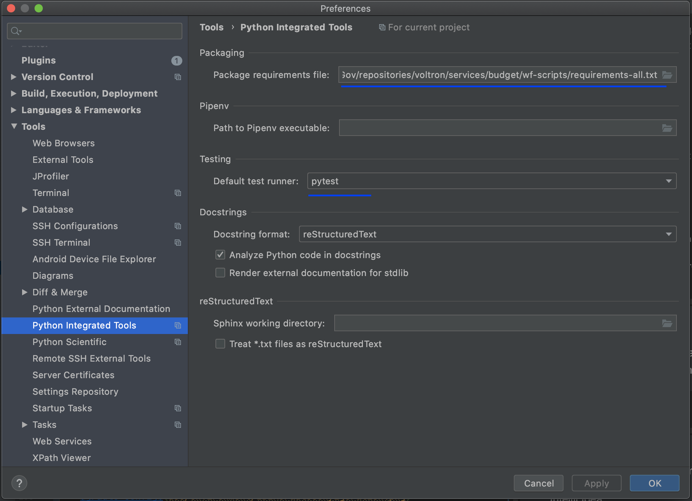

# SCHNORR-MUSIG-SDK-PYTHON

## Overview

Repository provides SDK client for developers.

## How to setup development environment:

**Prerequisites: Install Software & Configure**

- Install [python3.8](https://www.python.org/downloads/) for script execution
- Install [pip3](https://pip.pypa.io/en/stable/installing/) for python package management
- Build [schnorr-musig-c](https://github.com/zksync-sdk/schnorr-musig-c) for your platform
  and add to `lib` directory: /usr/lib/local/libmusig_c.dylib or /usr/lib/libmusig_c.dylib 

## How to build/test/run/debug project

Project provides integration with such tools as setuptool, paver, tox and gives you ability to do the same task in
different ways.

**Here is the list of most used commands:**

    # 1. Install project dependencies    
    pip3 install -r requirements-all.txt
    
    # 2. Run all test (you may use any command)
    paver test_all                          # run test via paver (default way)
    python3 setup.py test                   # run test via setuptool        
    tox                                     # run test on a specified version of python (see tox.ini)
    
    # 3. Installing package to pip3 manager
    pip3 install .                          # installing package

**Debugging application:**

1. Configure IDE python interpreter to python3.8.

2. Configure IDE to use pytest as default test runner and set requirements-all.txt as dependency provider.

   

3. Now you are ready to use native IDE support:

        Run -> Run 'XXX.py'
        Run -> Debug 'XXX.py'

## How to use library (TODO)
